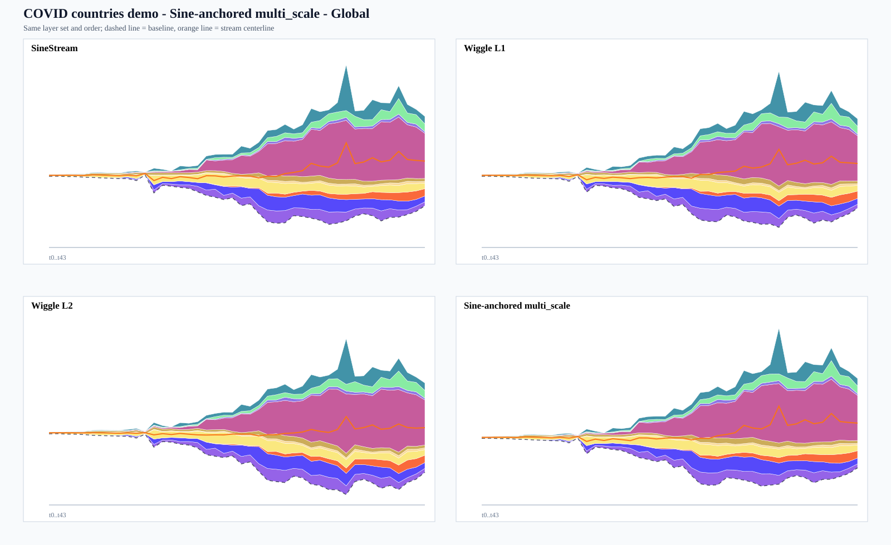
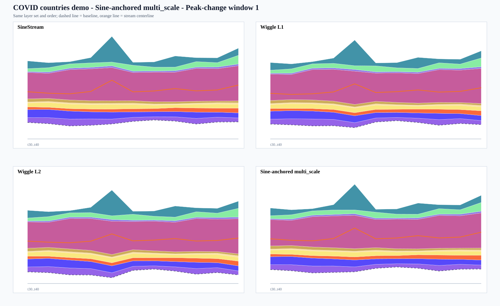
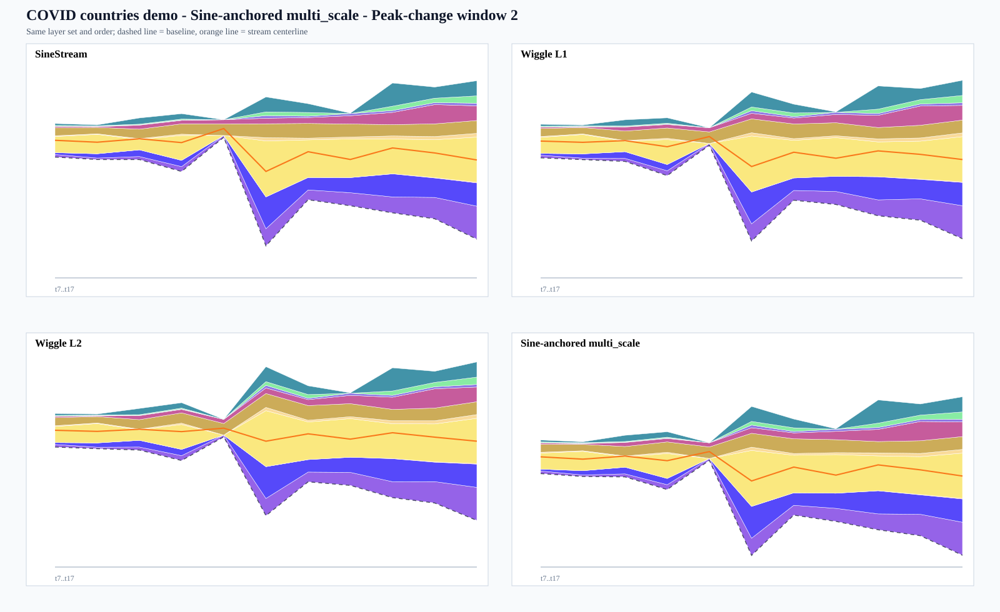
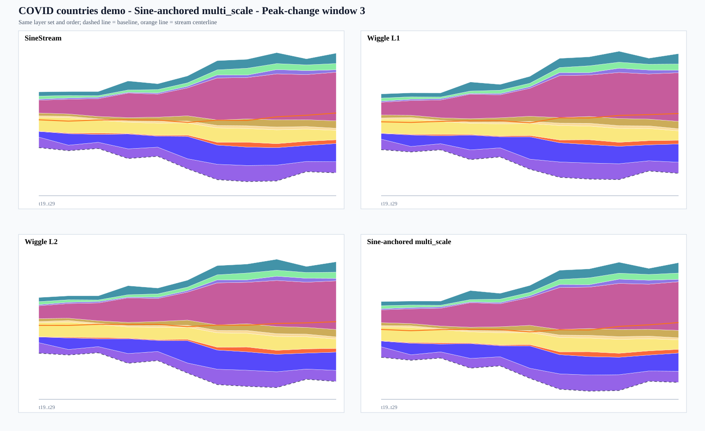
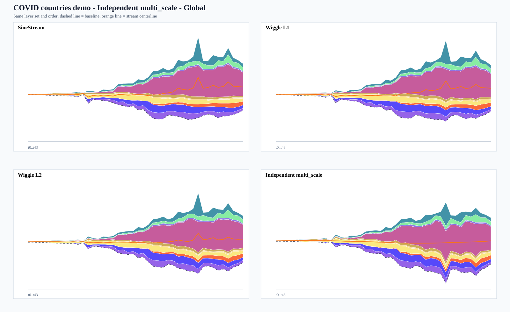
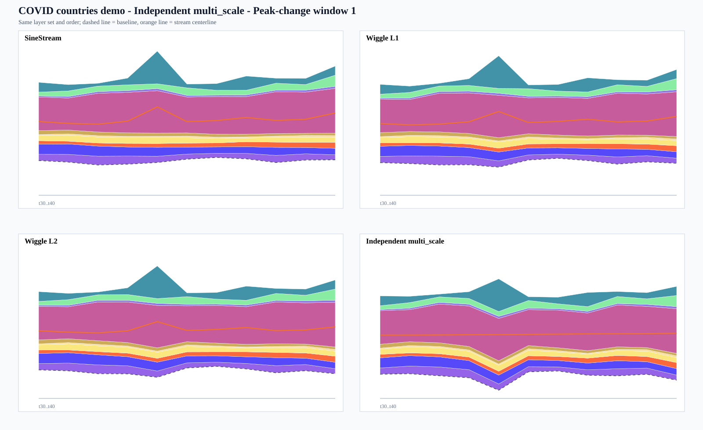
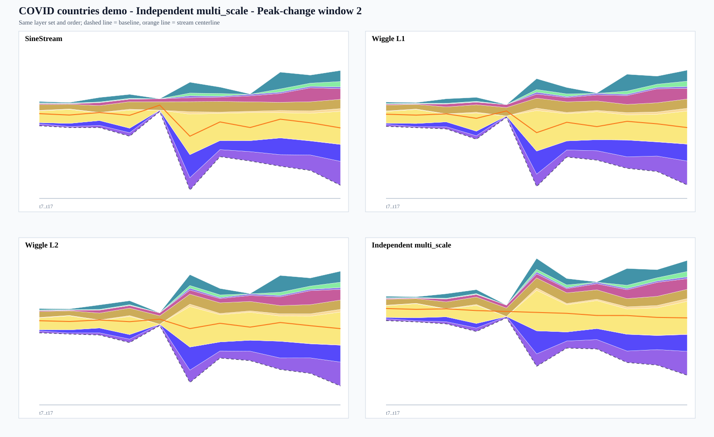
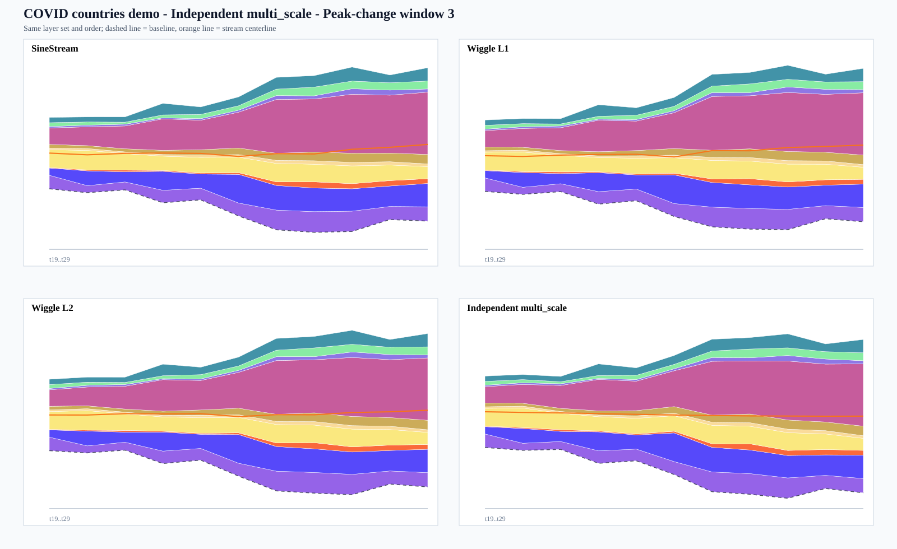

# 0611 SineStream Multi-scale Baseline Verification

Generated at: 2026-06-11T04:10:42.463Z

Overall status: **FAIL**

## Method

- Goal: compare only baseline behavior while holding the layer set and layer order fixed.
- Controls: SineStream baseline, weighted wiggle L1 baseline, weighted wiggle L2 baseline.
- Experiment A: Sine-anchored multi_scale (`computeMultiscaleDistributedBaseline`), the original route: start from SineStream and redistribute its centerline derivative bursts.
- Experiment B: Independent multi_scale (`computeIndependentMultiscaleBaseline`), the direct/centered ablation: start from centered baseline and optimize layer counter-motion multiscale bases.
- Ordering: fixed source layer order for all methods; this report does not claim TPID ordering contribution.
- Multi-scale parameters are selected from a deterministic grid over strength and Haar energy threshold.
- PASS requires each multi_scale variant to improve every core metric against every control in Global and selected peak-change windows.
- Guardrail: layer mean slope, layer max slope, layer curvature, and wiggle energy may not regress by more than 3%.

## Source Check

- PDF path: found (E:\Project\2026Journal\Bu 等 - 2021 - SineStream Improving the Readability of Streamgraphs by Minimizing Sine Illusion Effects.pdf)
- PDF text extraction: ok
- Paper datasets detected: COVID, Bank Interest, Call, Assistance, Agriculture, Population, Disease
- SineStream source data directory: found (E:\Project\2026Journal\Demo\SineStream\data)
- Fallback to Data/sine_demo.json: no

## Source notes

- Using source data first; project fallback also exists at Data\sine_demo.json.

## Acceptance Metrics

| Group | Metrics | Rule |
|---|---|---|
| Core | Paper Eq.(5) illusion, Readability score, Centerline max derivative, Derivative concentration, Top derivative mass share | improvement must be > 0% |
| Guardrail | Layer mean slope, Layer max slope, Layer curvature, Wiggle energy | regression must be >= -3% |

## Case: COVID countries demo

- Source: E:\Project\2026Journal\Demo\SineStream\data\demo.json
- Time points: 44
- Layers: 10
- Order policy: fixed source layer order for all baselines
- Fixed order: Germany, Spain, Turkey, Italy, Netherlands, Iran, US, Belgium, United Kingdom, France

### Variant: Sine-anchored multi_scale

- Route: original multi_scale: start from SineStream and redistribute SineStream centerline derivative bursts
- Selected params: center=median, strength=0.2000, threshold=0.2000
- Search: total=198, pass=0, fail=198
- Selected status: FAIL
- Diagnostics: verified=yes, fallback=no, effectiveScales=2

Selected failure reasons:
- Global vs SineStream: Paper Eq.(5) illusion did not improve (-3.25%)
- Global vs SineStream: Top derivative mass share did not improve (-1.14%)
- Global vs Wiggle L1: Readability score did not improve (-9.37%)
- Global vs Wiggle L1: Centerline max derivative did not improve (-24.21%)
- Global vs Wiggle L1: Derivative concentration did not improve (-0.41%)
- Global vs Wiggle L1: Top derivative mass share did not improve (-3.37%)
- Global vs Wiggle L1: Layer max slope regressed -18.15%
- Global vs Wiggle L1: Wiggle energy regressed -4.93%
- Global vs Wiggle L2: Readability score did not improve (-21.32%)
- Global vs Wiggle L2: Centerline max derivative did not improve (-48.30%)
- Global vs Wiggle L2: Layer max slope regressed -38.86%
- Peak-change window 1 vs SineStream: Paper Eq.(5) illusion did not improve (-9.10%)
- Peak-change window 1 vs Wiggle L1: Readability score did not improve (-7.25%)
- Peak-change window 1 vs Wiggle L1: Centerline max derivative did not improve (-24.21%)
- Peak-change window 1 vs Wiggle L1: Layer max slope regressed -18.15%
- Peak-change window 1 vs Wiggle L2: Readability score did not improve (-19.31%)
- Peak-change window 1 vs Wiggle L2: Centerline max derivative did not improve (-48.30%)
- Peak-change window 1 vs Wiggle L2: Derivative concentration did not improve (-1.74%)
- ... 17 more

#### Global

- Window: t0..t43
- Figure: [assets/covid-countries-demo-sineAnchoredMultiScale-global.svg](assets/covid-countries-demo-sineAnchoredMultiScale-global.svg)

| Control | Status | Metric | Control | Candidate | Delta | Improvement |
|---|---|---|---:|---:|---:|---:|
| SineStream | FAIL | Paper Eq.(5) illusion | 3.5131e+9 | 3.6272e+9 | 1.1409e+8 | -3.25% |
| SineStream | PASS | Readability score | 4.8153 | 4.6751 | -0.1402 | +2.91% |
| SineStream | PASS | Centerline max derivative | 11655.40 | 10765.46 | -889.9457 | +7.64% |
| SineStream | PASS | Derivative concentration | 7.3272 | 7.2951 | -0.0321 | +0.44% |
| SineStream | FAIL | Top derivative mass share | 0.4070 | 0.4117 | 0.0047 | -1.14% |
| SineStream | PASS | Layer mean slope | 1003.35 | 1013.97 | 10.6108 | -1.06% |
| SineStream | PASS | Layer max slope | 14552.90 | 13662.96 | -889.9457 | +6.12% |
| SineStream | PASS | Layer curvature | 1596.39 | 1613.16 | 16.7663 | -1.05% |
| SineStream | PASS | Wiggle energy | 3.7432e+8 | 3.4056e+8 | -3.3762e+7 | +9.02% |
| Wiggle L1 | PASS | Paper Eq.(5) illusion | 5.5609e+9 | 3.6272e+9 | -1.9338e+9 | +34.77% |
| Wiggle L1 | FAIL | Readability score | 4.8006 | 5.2502 | 0.4496 | -9.37% |
| Wiggle L1 | FAIL | Centerline max derivative | 8666.85 | 10765.46 | 2098.60 | -24.21% |
| Wiggle L1 | FAIL | Derivative concentration | 7.2654 | 7.2951 | 0.0297 | -0.41% |
| Wiggle L1 | FAIL | Top derivative mass share | 0.3982 | 0.4117 | 0.0134 | -3.37% |
| Wiggle L1 | PASS | Layer mean slope | 1074.17 | 1013.97 | -60.2013 | +5.60% |
| Wiggle L1 | FAIL | Layer max slope | 11564.35 | 13662.96 | 2098.60 | -18.15% |
| Wiggle L1 | PASS | Layer curvature | 1711.65 | 1613.16 | -98.4907 | +5.75% |
| Wiggle L1 | FAIL | Wiggle energy | 3.2457e+8 | 3.4056e+8 | 1.5987e+7 | -4.93% |
| Wiggle L2 | PASS | Paper Eq.(5) illusion | 8.0067e+9 | 3.6272e+9 | -4.3796e+9 | +54.70% |
| Wiggle L2 | FAIL | Readability score | 4.8000 | 5.8236 | 1.0236 | -21.32% |
| Wiggle L2 | FAIL | Centerline max derivative | 7259.44 | 10765.46 | 3506.01 | -48.30% |
| Wiggle L2 | PASS | Derivative concentration | 8.1775 | 7.2951 | -0.8823 | +10.79% |
| Wiggle L2 | PASS | Top derivative mass share | 0.4360 | 0.4117 | -0.0243 | +5.57% |
| Wiggle L2 | PASS | Layer mean slope | 1180.48 | 1013.97 | -166.5142 | +14.11% |
| Wiggle L2 | FAIL | Layer max slope | 9839.20 | 13662.96 | 3823.75 | -38.86% |
| Wiggle L2 | PASS | Layer curvature | 1885.06 | 1613.16 | -271.9022 | +14.42% |
| Wiggle L2 | PASS | Wiggle energy | 3.3951e+8 | 3.4056e+8 | 1.0478e+6 | -0.31% |

#### Peak-change window 1

- Window: t30..t40
- Peak change index: t35, delta=28516.00
- Figure: [assets/covid-countries-demo-sineAnchoredMultiScale-peak-1.svg](assets/covid-countries-demo-sineAnchoredMultiScale-peak-1.svg)

| Control | Status | Metric | Control | Candidate | Delta | Improvement |
|---|---|---|---:|---:|---:|---:|
| SineStream | FAIL | Paper Eq.(5) illusion | 4.4068e+9 | 4.8079e+9 | 4.0109e+8 | -9.10% |
| SineStream | PASS | Readability score | 4.8000 | 4.6439 | -0.1561 | +3.25% |
| SineStream | PASS | Centerline max derivative | 11655.40 | 10765.46 | -889.9457 | +7.64% |
| SineStream | PASS | Derivative concentration | 3.0004 | 2.9379 | -0.0625 | +2.08% |
| SineStream | PASS | Top derivative mass share | 0.3000 | 0.2938 | -0.0062 | +2.08% |
| SineStream | PASS | Layer mean slope | 1284.79 | 1305.78 | 20.9895 | -1.63% |
| SineStream | PASS | Layer max slope | 14552.90 | 13662.96 | -889.9457 | +6.12% |
| SineStream | PASS | Layer curvature | 2131.02 | 2159.02 | 27.9965 | -1.31% |
| SineStream | PASS | Wiggle energy | 1.4082e+8 | 1.2749e+8 | -1.3330e+7 | +9.47% |
| Wiggle L1 | PASS | Paper Eq.(5) illusion | 1.1273e+10 | 4.8079e+9 | -6.4655e+9 | +57.35% |
| Wiggle L1 | FAIL | Readability score | 4.8000 | 5.1481 | 0.3481 | -7.25% |
| Wiggle L1 | FAIL | Centerline max derivative | 8666.85 | 10765.46 | 2098.60 | -24.21% |
| Wiggle L1 | PASS | Derivative concentration | 2.9539 | 2.9379 | -0.0160 | +0.54% |
| Wiggle L1 | PASS | Top derivative mass share | 0.2954 | 0.2938 | -0.0016 | +0.54% |
| Wiggle L1 | PASS | Layer mean slope | 1584.93 | 1305.78 | -279.1580 | +17.61% |
| Wiggle L1 | FAIL | Layer max slope | 11564.35 | 13662.96 | 2098.60 | -18.15% |
| Wiggle L1 | PASS | Layer curvature | 2644.85 | 2159.02 | -485.8286 | +18.37% |
| Wiggle L1 | PASS | Wiggle energy | 1.3381e+8 | 1.2749e+8 | -6.3168e+6 | +4.72% |
| Wiggle L2 | PASS | Paper Eq.(5) illusion | 1.7944e+10 | 4.8079e+9 | -1.3136e+10 | +73.21% |
| Wiggle L2 | FAIL | Readability score | 4.8000 | 5.7268 | 0.9268 | -19.31% |
| Wiggle L2 | FAIL | Centerline max derivative | 7259.44 | 10765.46 | 3506.01 | -48.30% |
| Wiggle L2 | FAIL | Derivative concentration | 2.8877 | 2.9379 | 0.0502 | -1.74% |
| Wiggle L2 | FAIL | Top derivative mass share | 0.2888 | 0.2938 | 0.0050 | -1.74% |
| Wiggle L2 | PASS | Layer mean slope | 1820.25 | 1305.78 | -514.4784 | +28.26% |
| Wiggle L2 | FAIL | Layer max slope | 9839.20 | 13662.96 | 3823.75 | -38.86% |
| Wiggle L2 | PASS | Layer curvature | 3012.84 | 2159.02 | -853.8228 | +28.34% |
| Wiggle L2 | PASS | Wiggle energy | 1.5729e+8 | 1.2749e+8 | -2.9799e+7 | +18.95% |

#### Peak-change window 2

- Window: t7..t17
- Peak change index: t12, delta=12211.00
- Figure: [assets/covid-countries-demo-sineAnchoredMultiScale-peak-2.svg](assets/covid-countries-demo-sineAnchoredMultiScale-peak-2.svg)

| Control | Status | Metric | Control | Candidate | Delta | Improvement |
|---|---|---|---:|---:|---:|---:|
| SineStream | FAIL | Paper Eq.(5) illusion | 5.4074e+7 | 1.3977e+8 | 8.5692e+7 | -158.47% |
| SineStream | PASS | Readability score | 4.9155 | 4.1884 | -0.7271 | +14.79% |
| SineStream | PASS | Centerline max derivative | 3986.25 | 2727.66 | -1258.58 | +31.57% |
| SineStream | PASS | Derivative concentration | 3.6631 | 3.2024 | -0.4607 | +12.58% |
| SineStream | PASS | Top derivative mass share | 0.3663 | 0.3202 | -0.0461 | +12.58% |
| SineStream | FAIL | Layer mean slope | 692.0022 | 720.4015 | 28.3993 | -4.10% |
| SineStream | PASS | Layer max slope | 9378.25 | 8119.66 | -1258.58 | +13.42% |
| SineStream | FAIL | Layer curvature | 1370.30 | 1441.74 | 71.4334 | -5.21% |
| SineStream | PASS | Wiggle energy | 7.8250e+7 | 6.0222e+7 | -1.8028e+7 | +23.04% |
| Wiggle L1 | PASS | Paper Eq.(5) illusion | 1.5256e+8 | 1.3977e+8 | -1.2795e+7 | +8.39% |
| Wiggle L1 | PASS | Readability score | 4.9005 | 4.7098 | -0.1907 | +3.89% |
| Wiggle L1 | PASS | Centerline max derivative | 2784.63 | 2727.66 | -56.9656 | +2.05% |
| Wiggle L1 | PASS | Derivative concentration | 3.5050 | 3.2024 | -0.3026 | +8.63% |
| Wiggle L1 | PASS | Top derivative mass share | 0.3505 | 0.3202 | -0.0303 | +8.63% |
| Wiggle L1 | PASS | Layer mean slope | 731.7511 | 720.4015 | -11.3496 | +1.55% |
| Wiggle L1 | PASS | Layer max slope | 8176.63 | 8119.66 | -56.9656 | +0.70% |
| Wiggle L1 | PASS | Layer curvature | 1478.39 | 1441.74 | -36.6592 | +2.48% |
| Wiggle L1 | PASS | Wiggle energy | 6.1374e+7 | 6.0222e+7 | -1.1517e+6 | +1.88% |
| Wiggle L2 | PASS | Paper Eq.(5) illusion | 4.9037e+8 | 1.3977e+8 | -3.5061e+8 | +71.50% |
| Wiggle L2 | FAIL | Readability score | 4.8093 | 7.1855 | 2.3762 | -49.41% |
| Wiggle L2 | FAIL | Centerline max derivative | 1211.52 | 2727.66 | 1516.15 | -125.14% |
| Wiggle L2 | FAIL | Derivative concentration | 2.6300 | 3.2024 | 0.5724 | -21.76% |
| Wiggle L2 | FAIL | Top derivative mass share | 0.2630 | 0.3202 | 0.0572 | -21.76% |
| Wiggle L2 | PASS | Layer mean slope | 810.7867 | 720.4015 | -90.3851 | +11.15% |
| Wiggle L2 | FAIL | Layer max slope | 6603.52 | 8119.66 | 1516.15 | -22.96% |
| Wiggle L2 | PASS | Layer curvature | 1642.90 | 1441.74 | -201.1621 | +12.24% |
| Wiggle L2 | FAIL | Wiggle energy | 5.6472e+7 | 6.0222e+7 | 3.7501e+6 | -6.64% |

#### Peak-change window 3

- Window: t19..t29
- Peak change index: t24, delta=8757.00
- Figure: [assets/covid-countries-demo-sineAnchoredMultiScale-peak-3.svg](assets/covid-countries-demo-sineAnchoredMultiScale-peak-3.svg)

| Control | Status | Metric | Control | Candidate | Delta | Improvement |
|---|---|---|---:|---:|---:|---:|
| SineStream | FAIL | Paper Eq.(5) illusion | 6.4546e+9 | 6.4557e+9 | 1.0835e+6 | -0.02% |
| SineStream | PASS | Readability score | 4.8000 | 4.7883 | -0.0117 | +0.24% |
| SineStream | PASS | Centerline max derivative | 1575.48 | 1554.97 | -20.5119 | +1.30% |
| SineStream | FAIL | Derivative concentration | 2.3947 | 2.4109 | 0.0162 | -0.68% |
| SineStream | FAIL | Top derivative mass share | 0.2395 | 0.2411 | 0.0016 | -0.68% |
| SineStream | PASS | Layer mean slope | 1124.29 | 1126.56 | 2.2741 | -0.20% |
| SineStream | PASS | Layer max slope | 6075.48 | 6044.31 | -31.1673 | +0.51% |
| SineStream | PASS | Layer curvature | 1727.89 | 1733.75 | 5.8554 | -0.34% |
| SineStream | PASS | Wiggle energy | 4.4017e+7 | 4.3986e+7 | -31356.17 | +0.07% |
| Wiggle L1 | PASS | Paper Eq.(5) illusion | 7.0856e+9 | 6.4557e+9 | -6.2994e+8 | +8.89% |
| Wiggle L1 | PASS | Readability score | 4.8000 | 3.7771 | -1.0229 | +21.31% |
| Wiggle L1 | PASS | Centerline max derivative | 2139.81 | 1554.97 | -584.8421 | +27.33% |
| Wiggle L1 | PASS | Derivative concentration | 3.5480 | 2.4109 | -1.1371 | +32.05% |
| Wiggle L1 | PASS | Top derivative mass share | 0.3548 | 0.2411 | -0.1137 | +32.05% |
| Wiggle L1 | PASS | Layer mean slope | 1097.92 | 1126.56 | 28.6387 | -2.61% |
| Wiggle L1 | PASS | Layer max slope | 7263.81 | 6044.31 | -1219.50 | +16.79% |
| Wiggle L1 | PASS | Layer curvature | 1729.54 | 1733.75 | 4.2045 | -0.24% |
| Wiggle L1 | PASS | Wiggle energy | 4.5757e+7 | 4.3986e+7 | -1.7719e+6 | +3.87% |
| Wiggle L2 | PASS | Paper Eq.(5) illusion | 6.9457e+9 | 6.4557e+9 | -4.8998e+8 | +7.05% |
| Wiggle L2 | FAIL | Readability score | 4.8000 | 5.6131 | 0.8131 | -16.94% |
| Wiggle L2 | FAIL | Centerline max derivative | 988.1111 | 1554.97 | 566.8616 | -57.37% |
| Wiggle L2 | PASS | Derivative concentration | 2.5779 | 2.4109 | -0.1670 | +6.48% |
| Wiggle L2 | PASS | Top derivative mass share | 0.2578 | 0.2411 | -0.0167 | +6.48% |
| Wiggle L2 | PASS | Layer mean slope | 1142.72 | 1126.56 | -16.1605 | +1.41% |
| Wiggle L2 | FAIL | Layer max slope | 5779.81 | 6044.31 | 264.4967 | -4.58% |
| Wiggle L2 | PASS | Layer curvature | 1753.19 | 1733.75 | -19.4474 | +1.11% |
| Wiggle L2 | PASS | Wiggle energy | 4.3498e+7 | 4.3986e+7 | 487266.91 | -1.12% |

### Variant: Independent multi_scale

- Route: direct/centered ablation: start from centered baseline and optimize layer counter-motion multiscale bases
- Selected params: center=median, strength=1.2000, threshold=0.1800
- Search: total=198, pass=0, fail=198
- Selected status: FAIL
- Diagnostics: verified=yes, fallback=no, effectiveScales=3

Selected failure reasons:
- Global vs SineStream: Paper Eq.(5) illusion did not improve (-699.36%)
- Global vs SineStream: Layer mean slope regressed -72.19%
- Global vs SineStream: Layer curvature regressed -78.55%
- Global vs SineStream: Wiggle energy regressed -159.71%
- Global vs Wiggle L1: Paper Eq.(5) illusion did not improve (-404.99%)
- Global vs Wiggle L1: Layer mean slope regressed -60.83%
- Global vs Wiggle L1: Layer max slope regressed -21.16%
- Global vs Wiggle L1: Layer curvature regressed -66.53%
- Global vs Wiggle L1: Wiggle energy regressed -199.51%
- Global vs Wiggle L2: Paper Eq.(5) illusion did not improve (-250.73%)
- Global vs Wiggle L2: Layer mean slope regressed -46.35%
- Global vs Wiggle L2: Layer max slope regressed -42.40%
- Global vs Wiggle L2: Layer curvature regressed -51.21%
- Global vs Wiggle L2: Wiggle energy regressed -186.33%
- Peak-change window 1 vs SineStream: Paper Eq.(5) illusion did not improve (-2018.74%)
- Peak-change window 1 vs SineStream: Layer mean slope regressed -182.04%
- Peak-change window 1 vs SineStream: Layer curvature regressed -201.72%
- Peak-change window 1 vs SineStream: Wiggle energy regressed -407.07%
- ... 33 more

#### Global

- Window: t0..t43
- Figure: [assets/covid-countries-demo-independentMultiScale-global.svg](assets/covid-countries-demo-independentMultiScale-global.svg)

| Control | Status | Metric | Control | Candidate | Delta | Improvement |
|---|---|---|---:|---:|---:|---:|
| SineStream | FAIL | Paper Eq.(5) illusion | 3.5131e+9 | 2.8082e+10 | 2.4569e+10 | -699.36% |
| SineStream | PASS | Readability score | 4.8153 | 2.5703 | -2.2450 | +46.62% |
| SineStream | PASS | Centerline max derivative | 11655.40 | 446.2122 | -11209.19 | +96.17% |
| SineStream | PASS | Derivative concentration | 7.3272 | 3.1299 | -4.1973 | +57.28% |
| SineStream | PASS | Top derivative mass share | 0.4070 | 0.1705 | -0.2365 | +58.11% |
| SineStream | FAIL | Layer mean slope | 1003.35 | 1727.63 | 724.2749 | -72.19% |
| SineStream | PASS | Layer max slope | 14552.90 | 14011.09 | -541.8160 | +3.72% |
| SineStream | FAIL | Layer curvature | 1596.39 | 2850.35 | 1253.95 | -78.55% |
| SineStream | FAIL | Wiggle energy | 3.7432e+8 | 9.7213e+8 | 5.9781e+8 | -159.71% |
| Wiggle L1 | FAIL | Paper Eq.(5) illusion | 5.5609e+9 | 2.8082e+10 | 2.2521e+10 | -404.99% |
| Wiggle L1 | PASS | Readability score | 4.8006 | 2.5909 | -2.2097 | +46.03% |
| Wiggle L1 | PASS | Centerline max derivative | 8666.85 | 446.2122 | -8220.64 | +94.85% |
| Wiggle L1 | PASS | Derivative concentration | 7.2654 | 3.1299 | -4.1355 | +56.92% |
| Wiggle L1 | PASS | Top derivative mass share | 0.3982 | 0.1705 | -0.2277 | +57.19% |
| Wiggle L1 | FAIL | Layer mean slope | 1074.17 | 1727.63 | 653.4628 | -60.83% |
| Wiggle L1 | FAIL | Layer max slope | 11564.35 | 14011.09 | 2446.73 | -21.16% |
| Wiggle L1 | FAIL | Layer curvature | 1711.65 | 2850.35 | 1138.70 | -66.53% |
| Wiggle L1 | FAIL | Wiggle energy | 3.2457e+8 | 9.7213e+8 | 6.4756e+8 | -199.51% |
| Wiggle L2 | FAIL | Paper Eq.(5) illusion | 8.0067e+9 | 2.8082e+10 | 2.0075e+10 | -250.73% |
| Wiggle L2 | PASS | Readability score | 4.8000 | 2.4760 | -2.3240 | +48.42% |
| Wiggle L2 | PASS | Centerline max derivative | 7259.44 | 446.2122 | -6813.23 | +93.85% |
| Wiggle L2 | PASS | Derivative concentration | 8.1775 | 3.1299 | -5.0475 | +61.73% |
| Wiggle L2 | PASS | Top derivative mass share | 0.4360 | 0.1705 | -0.2655 | +60.89% |
| Wiggle L2 | FAIL | Layer mean slope | 1180.48 | 1727.63 | 547.1500 | -46.35% |
| Wiggle L2 | FAIL | Layer max slope | 9839.20 | 14011.09 | 4171.88 | -42.40% |
| Wiggle L2 | FAIL | Layer curvature | 1885.06 | 2850.35 | 965.2837 | -51.21% |
| Wiggle L2 | FAIL | Wiggle energy | 3.3951e+8 | 9.7213e+8 | 6.3262e+8 | -186.33% |

#### Peak-change window 1

- Window: t30..t40
- Peak change index: t35, delta=28516.00
- Figure: [assets/covid-countries-demo-independentMultiScale-peak-1.svg](assets/covid-countries-demo-independentMultiScale-peak-1.svg)

| Control | Status | Metric | Control | Candidate | Delta | Improvement |
|---|---|---|---:|---:|---:|---:|
| SineStream | FAIL | Paper Eq.(5) illusion | 4.4068e+9 | 9.3368e+10 | 8.8961e+10 | -2018.74% |
| SineStream | PASS | Readability score | 4.8000 | 3.3501 | -1.4499 | +30.21% |
| SineStream | PASS | Centerline max derivative | 11655.40 | 204.7973 | -11450.60 | +98.24% |
| SineStream | PASS | Derivative concentration | 3.0004 | 1.4285 | -1.5719 | +52.39% |
| SineStream | PASS | Top derivative mass share | 0.3000 | 0.1429 | -0.1572 | +52.39% |
| SineStream | FAIL | Layer mean slope | 1284.79 | 3623.65 | 2338.86 | -182.04% |
| SineStream | PASS | Layer max slope | 14552.90 | 14011.09 | -541.8160 | +3.72% |
| SineStream | FAIL | Layer curvature | 2131.02 | 6429.74 | 4298.72 | -201.72% |
| SineStream | FAIL | Wiggle energy | 1.4082e+8 | 7.1407e+8 | 5.7325e+8 | -407.07% |
| Wiggle L1 | FAIL | Paper Eq.(5) illusion | 1.1273e+10 | 9.3368e+10 | 8.2095e+10 | -728.22% |
| Wiggle L1 | PASS | Readability score | 4.8000 | 3.1028 | -1.6972 | +35.36% |
| Wiggle L1 | PASS | Centerline max derivative | 8666.85 | 204.7973 | -8462.05 | +97.64% |
| Wiggle L1 | PASS | Derivative concentration | 2.9539 | 1.4285 | -1.5254 | +51.64% |
| Wiggle L1 | PASS | Top derivative mass share | 0.2954 | 0.1429 | -0.1525 | +51.64% |
| Wiggle L1 | FAIL | Layer mean slope | 1584.93 | 3623.65 | 2038.71 | -128.63% |
| Wiggle L1 | FAIL | Layer max slope | 11564.35 | 14011.09 | 2446.73 | -21.16% |
| Wiggle L1 | FAIL | Layer curvature | 2644.85 | 6429.74 | 3784.89 | -143.10% |
| Wiggle L1 | FAIL | Wiggle energy | 1.3381e+8 | 7.1407e+8 | 5.8026e+8 | -433.65% |
| Wiggle L2 | FAIL | Paper Eq.(5) illusion | 1.7944e+10 | 9.3368e+10 | 7.5424e+10 | -420.34% |
| Wiggle L2 | PASS | Readability score | 4.8000 | 3.0453 | -1.7547 | +36.56% |
| Wiggle L2 | PASS | Centerline max derivative | 7259.44 | 204.7973 | -7054.65 | +97.18% |
| Wiggle L2 | PASS | Derivative concentration | 2.8877 | 1.4285 | -1.4592 | +50.53% |
| Wiggle L2 | PASS | Top derivative mass share | 0.2888 | 0.1429 | -0.1459 | +50.53% |
| Wiggle L2 | FAIL | Layer mean slope | 1820.25 | 3623.65 | 1803.39 | -99.07% |
| Wiggle L2 | FAIL | Layer max slope | 9839.20 | 14011.09 | 4171.88 | -42.40% |
| Wiggle L2 | FAIL | Layer curvature | 3012.84 | 6429.74 | 3416.90 | -113.41% |
| Wiggle L2 | FAIL | Wiggle energy | 1.5729e+8 | 7.1407e+8 | 5.5678e+8 | -353.98% |

#### Peak-change window 2

- Window: t7..t17
- Peak change index: t12, delta=12211.00
- Figure: [assets/covid-countries-demo-independentMultiScale-peak-2.svg](assets/covid-countries-demo-independentMultiScale-peak-2.svg)

| Control | Status | Metric | Control | Candidate | Delta | Improvement |
|---|---|---|---:|---:|---:|---:|
| SineStream | FAIL | Paper Eq.(5) illusion | 5.4074e+7 | 1.0648e+9 | 1.0107e+9 | -1869.15% |
| SineStream | PASS | Readability score | 4.9155 | 2.7104 | -2.2051 | +44.86% |
| SineStream | PASS | Centerline max derivative | 3986.25 | 275.4095 | -3710.84 | +93.09% |
| SineStream | PASS | Derivative concentration | 3.6631 | 2.0577 | -1.6054 | +43.83% |
| SineStream | PASS | Top derivative mass share | 0.3663 | 0.2058 | -0.1605 | +43.83% |
| SineStream | FAIL | Layer mean slope | 692.0022 | 981.3900 | 289.3878 | -41.82% |
| SineStream | PASS | Layer max slope | 9378.25 | 5511.95 | -3866.29 | +41.23% |
| SineStream | FAIL | Layer curvature | 1370.30 | 1996.42 | 626.1191 | -45.69% |
| SineStream | PASS | Wiggle energy | 7.8250e+7 | 7.1300e+7 | -6.9499e+6 | +8.88% |
| Wiggle L1 | FAIL | Paper Eq.(5) illusion | 1.5256e+8 | 1.0648e+9 | 9.1223e+8 | -597.95% |
| Wiggle L1 | PASS | Readability score | 4.9005 | 2.7708 | -2.1297 | +43.46% |
| Wiggle L1 | PASS | Centerline max derivative | 2784.63 | 275.4095 | -2509.22 | +90.11% |
| Wiggle L1 | PASS | Derivative concentration | 3.5050 | 2.0577 | -1.4472 | +41.29% |
| Wiggle L1 | PASS | Top derivative mass share | 0.3505 | 0.2058 | -0.1447 | +41.29% |
| Wiggle L1 | FAIL | Layer mean slope | 731.7511 | 981.3900 | 249.6389 | -34.12% |
| Wiggle L1 | PASS | Layer max slope | 8176.63 | 5511.95 | -2664.68 | +32.59% |
| Wiggle L1 | FAIL | Layer curvature | 1478.39 | 1996.42 | 518.0265 | -35.04% |
| Wiggle L1 | FAIL | Wiggle energy | 6.1374e+7 | 7.1300e+7 | 9.9263e+6 | -16.17% |
| Wiggle L2 | FAIL | Paper Eq.(5) illusion | 4.9037e+8 | 1.0648e+9 | 5.7442e+8 | -117.14% |
| Wiggle L2 | PASS | Readability score | 4.8093 | 3.3554 | -1.4539 | +30.23% |
| Wiggle L2 | PASS | Centerline max derivative | 1211.52 | 275.4095 | -936.1090 | +77.27% |
| Wiggle L2 | PASS | Derivative concentration | 2.6300 | 2.0577 | -0.5722 | +21.76% |
| Wiggle L2 | PASS | Top derivative mass share | 0.2630 | 0.2058 | -0.0572 | +21.76% |
| Wiggle L2 | FAIL | Layer mean slope | 810.7867 | 981.3900 | 170.6034 | -21.04% |
| Wiggle L2 | PASS | Layer max slope | 6603.52 | 5511.95 | -1091.57 | +16.53% |
| Wiggle L2 | FAIL | Layer curvature | 1642.90 | 1996.42 | 353.5236 | -21.52% |
| Wiggle L2 | FAIL | Wiggle energy | 5.6472e+7 | 7.1300e+7 | 1.4828e+7 | -26.26% |

#### Peak-change window 3

- Window: t19..t29
- Peak change index: t24, delta=8757.00
- Figure: [assets/covid-countries-demo-independentMultiScale-peak-3.svg](assets/covid-countries-demo-independentMultiScale-peak-3.svg)

| Control | Status | Metric | Control | Candidate | Delta | Improvement |
|---|---|---|---:|---:|---:|---:|
| SineStream | FAIL | Paper Eq.(5) illusion | 6.4546e+9 | 8.6695e+9 | 2.2149e+9 | -34.31% |
| SineStream | PASS | Readability score | 4.8000 | 2.7965 | -2.0035 | +41.74% |
| SineStream | PASS | Centerline max derivative | 1575.48 | 239.7679 | -1335.72 | +84.78% |
| SineStream | PASS | Derivative concentration | 2.3947 | 1.5814 | -0.8133 | +33.96% |
| SineStream | PASS | Top derivative mass share | 0.2395 | 0.1581 | -0.0813 | +33.96% |
| SineStream | FAIL | Layer mean slope | 1124.29 | 1318.21 | 193.9204 | -17.25% |
| SineStream | PASS | Layer max slope | 6075.48 | 4972.09 | -1103.39 | +18.16% |
| SineStream | FAIL | Layer curvature | 1727.89 | 1989.42 | 261.5276 | -15.14% |
| SineStream | FAIL | Wiggle energy | 4.4017e+7 | 5.2647e+7 | 8.6297e+6 | -19.61% |
| Wiggle L1 | FAIL | Paper Eq.(5) illusion | 7.0856e+9 | 8.6695e+9 | 1.5839e+9 | -22.35% |
| Wiggle L1 | PASS | Readability score | 4.8000 | 2.2890 | -2.5110 | +52.31% |
| Wiggle L1 | PASS | Centerline max derivative | 2139.81 | 239.7679 | -1900.05 | +88.79% |
| Wiggle L1 | PASS | Derivative concentration | 3.5480 | 1.5814 | -1.9666 | +55.43% |
| Wiggle L1 | PASS | Top derivative mass share | 0.3548 | 0.1581 | -0.1967 | +55.43% |
| Wiggle L1 | FAIL | Layer mean slope | 1097.92 | 1318.21 | 220.2850 | -20.06% |
| Wiggle L1 | PASS | Layer max slope | 7263.81 | 4972.09 | -2291.72 | +31.55% |
| Wiggle L1 | FAIL | Layer curvature | 1729.54 | 1989.42 | 259.8767 | -15.03% |
| Wiggle L1 | FAIL | Wiggle energy | 4.5757e+7 | 5.2647e+7 | 6.8892e+6 | -15.06% |
| Wiggle L2 | FAIL | Paper Eq.(5) illusion | 6.9457e+9 | 8.6695e+9 | 1.7238e+9 | -24.82% |
| Wiggle L2 | PASS | Readability score | 4.8000 | 2.8721 | -1.9279 | +40.16% |
| Wiggle L2 | PASS | Centerline max derivative | 988.1111 | 239.7679 | -748.3432 | +75.73% |
| Wiggle L2 | PASS | Derivative concentration | 2.5779 | 1.5814 | -0.9966 | +38.66% |
| Wiggle L2 | PASS | Top derivative mass share | 0.2578 | 0.1581 | -0.0997 | +38.66% |
| Wiggle L2 | FAIL | Layer mean slope | 1142.72 | 1318.21 | 175.4858 | -15.36% |
| Wiggle L2 | PASS | Layer max slope | 5779.81 | 4972.09 | -807.7245 | +13.97% |
| Wiggle L2 | FAIL | Layer curvature | 1753.19 | 1989.42 | 236.2249 | -13.47% |
| Wiggle L2 | FAIL | Wiggle energy | 4.3498e+7 | 5.2647e+7 | 9.1483e+6 | -21.03% |
