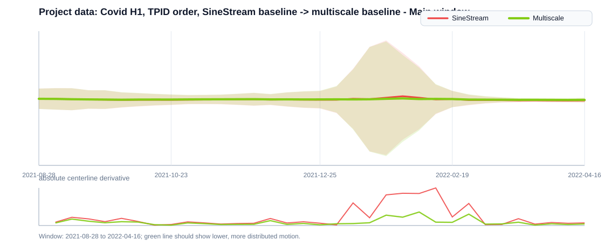
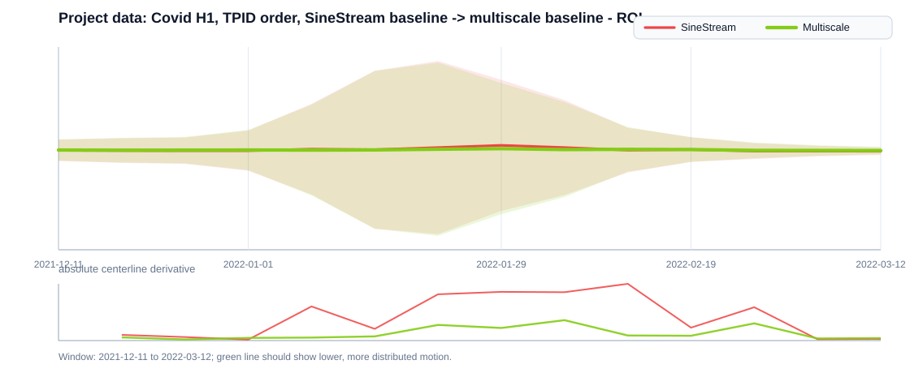
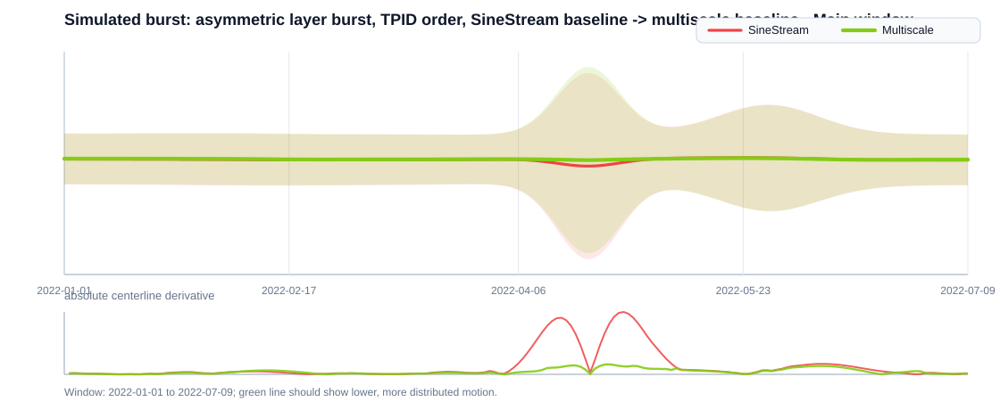
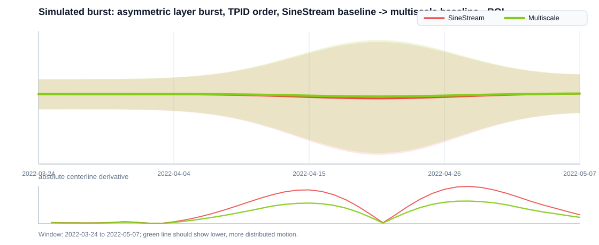

# Multiscale Centerline Readability Check

Generated at: 2026-05-12T18:38:11.996Z

## Formal problem

Let f_i(t) be layer thickness, H(t)=sum_i f_i(t), b(t) be the baseline, and c(t)=b(t)+H(t)/2 be the stream centerline.
The SineStream-style baseline can create a concentrated centerline derivative d(t)=c(t)-c(t-1) near a burst.
The desired multiscale baseline is not a flat centerline. It is a bounded wave that spreads derivative mass across several scale bands:

J(b)=w_p max|d| + w_c concentration(|d|) + w_m topMass(|d|) + w_k mean|Delta d| + w_l layerSlope + w_r corridorViolation - w_s slopeCoverage.

Subject to thickness invariance, fixed layer order, and a center corridor |c(t)-median(c)| <= rho H(t) with soft penalty.
Lower J is better. For the current implementation, SineStream is the anchor and multiscale is accepted when peak derivative, derivative concentration, burst mass share, and the aggregate score improve without a large layer mean-slope regression.

## Metric meanings

- Centerline peak derivative: maximum |c(t)-c(t-1)|. Lower means the one-burst centerline is suppressed.
- Derivative concentration: max derivative divided by mean derivative. Lower means motion is less dominated by one moment.
- Top-5% derivative mass: derivative mass held by the largest 5% of steps. Lower means less burst concentration.
- Slope coverage: soft fraction of time steps with nontrivial centerline slope. Higher means the desired small wave is active more globally.
- Corridor violation: amount by which centerline amplitude exceeds 18% of local stream thickness. Lower keeps the wave bounded.

## Project data: Covid H1, TPID order, SineStream baseline -> multiscale baseline

- time points: 135
- layers: 56
- ordering notes: TPID scoring: alpha=0.80 | top PID-time layer: NE score=0.461

Diagnostics:
- verifiedMultiscale: yes
- fallback: no
- energyThreshold: 0.0800
- selected/effective scales: 6/5
- active coefficients: 16:1.00, 256:0.75, 2:1.00, 8:-0.10, 4:0.35
- top scale energy: 16:21.7%, 256:20.7%, 2:14.8%, 64:13.8%, 8:11.7%, 4:8.9%
- internal objective: 3.8000 -> 2.5760

### Main window

- ROI: [57, 90] (2021-08-28 to 2022-04-16)
- Status: PASS
- Notes: all core centerline checks passed

| Metric | SineStream | Multiscale | Delta | Improvement | Better |
|---|---:|---:|---:|---:|---|
| Readability score | 4.8056 | 3.5539 | -1.2517 | +26.05% | down |
| Centerline peak derivative | 88790.8 | 31903.4 | -56887.3 | +64.07% | down |
| Derivative concentration | 4.5160 | 4.0800 | -0.4360 | +9.65% | down |
| Top-5% derivative mass | 0.2543 | 0.2277 | -0.0265 | +10.44% | down |
| Slope coverage | 0.8993 | 0.9787 | 0.0795 | +8.84% | up |
| Centerline curvature | 25874.1 | 10087.5 | -15786.6 | +61.01% | down |
| Layer mean slope | 52640.0 | 54987.5 | 2347.4 | -4.46% | down |
| Layer max slope | 9.960e+5 | 1.001e+6 | 5229.9 | -0.53% | down |
| Layer curvature | 51430.5 | 53255.2 | 1824.8 | -3.55% | down |
| Corridor violation | 4.477e-3 | 0.0000 | -4.477e-3 | +100.00% | down |

### ROI

- ROI: [72, 85] (2021-12-11 to 2022-03-12)
- Status: FAIL
- Notes: derivative concentration regressed -16.35%; burst mass share regressed -16.35%

| Metric | SineStream | Multiscale | Delta | Improvement | Better |
|---|---:|---:|---:|---:|---|
| Readability score | 4.8000 | 3.9679 | -0.8321 | +17.34% | down |
| Centerline peak derivative | 88790.8 | 31903.4 | -56887.3 | +64.07% | down |
| Derivative concentration | 2.4168 | 2.8119 | 0.3950 | -16.35% | down |
| Top-5% derivative mass | 0.1859 | 0.2163 | 0.0304 | -16.35% | down |
| Slope coverage | 0.8761 | 1.0000 | 0.1239 | +14.14% | up |
| Centerline curvature | 52107.5 | 16845.3 | -35262.3 | +67.67% | down |
| Layer mean slope | 1.156e+5 | 1.208e+5 | 5176.1 | -4.48% | down |
| Layer max slope | 9.960e+5 | 1.001e+6 | 5229.9 | -0.53% | down |
| Layer curvature | 1.136e+5 | 1.177e+5 | 4079.1 | -3.59% | down |
| Corridor violation | 0.0000 | 0.0000 | 0.0000 | +0.00% | down |

## Simulated burst: asymmetric layer burst, TPID order, SineStream baseline -> multiscale baseline

- time points: 190
- layers: 9
- ordering notes: TPID scoring: alpha=0.80 | top PID-time layer: burst-3 score=0.360

Diagnostics:
- verifiedMultiscale: yes
- fallback: no
- energyThreshold: 0.0800
- selected/effective scales: 2/2
- active coefficients: 64:1.00, 128:1.00
- top scale energy: 64:41.6%, 128:35.4%, 16:5.9%, 8:5.9%, 256:5.0%, 32:3.7%
- internal objective: 3.8000 -> 2.0467

### Main window

- ROI: [0, 189] (2022-01-01 to 2022-07-09)
- Status: PASS
- Notes: all core centerline checks passed

| Metric | SineStream | Multiscale | Delta | Improvement | Better |
|---|---:|---:|---:|---:|---|
| Readability score | 4.8000 | 2.4945 | -2.3055 | +48.03% | down |
| Centerline peak derivative | 5.2140 | 0.8342 | -4.3798 | +84.00% | down |
| Derivative concentration | 7.2927 | 3.5361 | -3.7566 | +51.51% | down |
| Top-5% derivative mass | 0.3525 | 0.1667 | -0.1858 | +52.71% | down |
| Slope coverage | 0.6195 | 0.9240 | 0.3045 | +49.15% | up |
| Centerline curvature | 0.1275 | 0.0373 | -0.0902 | +70.76% | down |
| Layer mean slope | 3.6116 | 3.5602 | -0.0514 | +1.42% | down |
| Layer max slope | 39.3850 | 40.4769 | 1.0919 | -2.77% | down |
| Layer curvature | 0.6288 | 0.6182 | -0.0106 | +1.69% | down |
| Corridor violation | 0.0000 | 0.0000 | 0.0000 | +0.00% | down |

### ROI

- ROI: [82, 126] (2022-03-24 to 2022-05-07)
- Status: PASS
- Notes: all core centerline checks passed

| Metric | SineStream | Multiscale | Delta | Improvement | Better |
|---|---:|---:|---:|---:|---|
| Readability score | 4.8000 | 3.1919 | -1.6081 | +33.50% | down |
| Centerline peak derivative | 5.2140 | 0.8342 | -4.3798 | +84.00% | down |
| Derivative concentration | 2.2033 | 2.0389 | -0.1644 | +7.46% | down |
| Top-5% derivative mass | 0.1481 | 0.1353 | -0.0128 | +8.63% | down |
| Slope coverage | 0.8872 | 0.9759 | 0.0887 | +10.00% | up |
| Centerline curvature | 0.4452 | 0.0714 | -0.3738 | +83.95% | down |
| Layer mean slope | 11.2071 | 10.9925 | -0.2147 | +1.92% | down |
| Layer max slope | 39.3850 | 40.4769 | 1.0919 | -2.77% | down |
| Layer curvature | 2.0998 | 2.0566 | -0.0432 | +2.06% | down |
| Corridor violation | 0.0000 | 0.0000 | 0.0000 | +0.00% | down |
