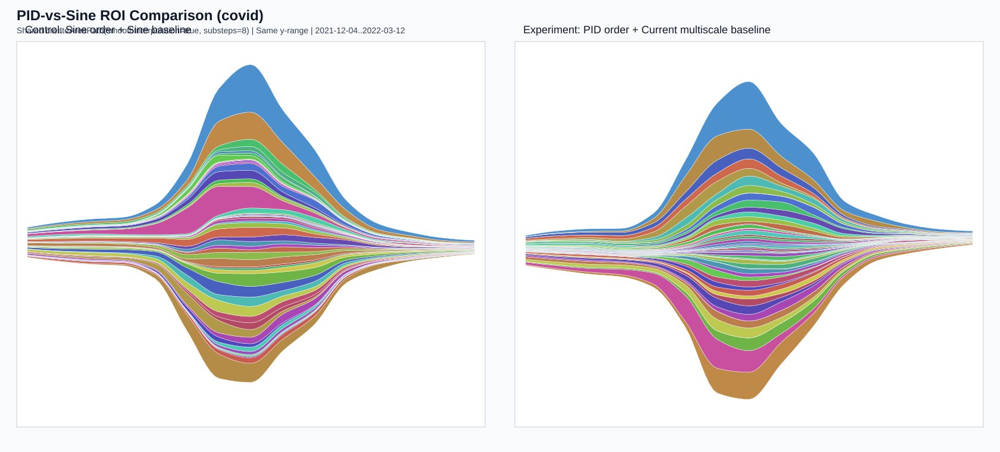

# PID-vs-Sine Detailed Metrics Report

Generated at: 2026-04-26T18:06:51.128Z

Final dataset used: **covid**
- ROI index: [71, 85] (span=15)
- ROI date: 2021-12-04 .. 2022-03-12
- ROI requested date range: 2021-12-04 .. 2022-03-12
- Control group: Sine ordering + Sine baseline
- Experiment group: PID ordering + current multiscale baseline
- Best params (from search): center=mean, weight=1.050, threshold=0.040

State coverage check:
- total states in dataset: 56
- control rendered states: 56
- experiment rendered states: 56
- all states covered in both groups: YES
- missing in control: (none)
- missing in experiment: (none)
- zero-thickness states in ROI (may appear visually very thin/flat): (none)
- zero-thickness states in Global: (none)

Illusion metric note:
- This report adds a paper-aligned illusion metric based on Eq.(5):
- `Illusion = 0.5 * (g'i + g'i-1)^2 * exp(-(f'i^2)/(2c^2)) * fi`, aggregated over layers/time by mean.
- `c` is computed with **median** of `|f'|` per time-step (paper default setting).
- Figure rendering uses shared `createAreaPath` with `smoothInterpolation=true`.

### ROI Metrics Difference

| Metric | Control (Sine) | Experiment (Current) | Delta (Exp-Control) | Improvement (down-better) |
|---|---:|---:|---:|---:|
| meanSlope | 151344.804945 | 110856.202696 | -40488.602250 | +26.75% |
| wiggle | 592842798434.576294 | 329039233819.309204 | -263803564615.267090 | +44.50% |
| illusion (paper Eq.5, median c) | 1381881895814255.750000 | 651419482284043.875000 | -730462413530211.875000 | +52.86% |

### Global Metrics Difference

| Metric | Control (Sine) | Experiment (Current) | Delta (Exp-Control) | Improvement (down-better) |
|---|---:|---:|---:|---:|
| meanSlope | 29942.505080 | 21492.981125 | -8449.523955 | +28.22% |
| wiggle | 676289967963.697144 | 380052061528.549805 | -296237906435.147339 | +43.80% |
| illusion (paper Eq.5, median c) | 147669874775987.250000 | 69905156290126.882813 | -77764718485860.375000 | +52.66% |

## Comparison Figures

### Global (Control vs Experiment)

### ROI (Control vs Experiment)

