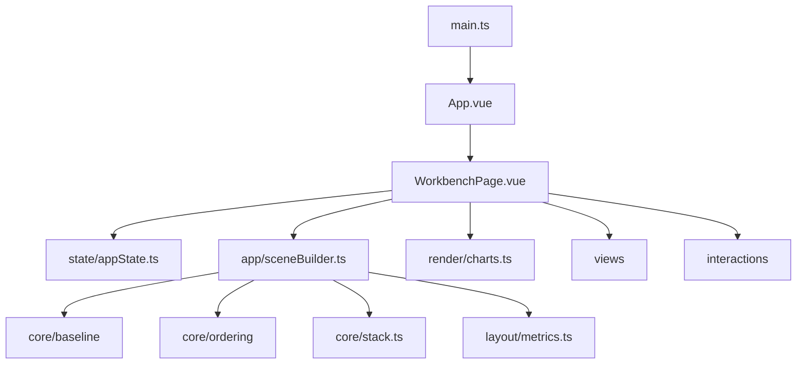

# System Architecture - Streamgraph Optimization Demo



## Data Flow

```text
Dataset
  -> preprocessDataset()
  -> orderLayers()/optimizeLayerOrder()
  -> computeBaseline()/computeOptimizingBaseline()
  -> computeStackedBoundaries()
  -> computeMetrics()
  -> D3/Vue rendering
```

## Notes

- `SceneBuildResult.afterLayout` is a plain `StackLayout`.
- The deprecated ROI gap layout is not part of the active system.
- Inset titles show the view mode, jagged-edge state, and interactivity only.
