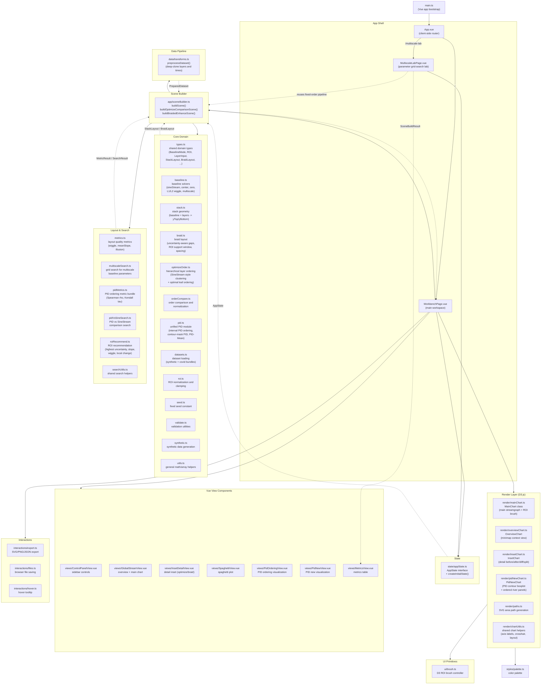

# System Architecture — Braided Streamgraph Demo



## Data Flow Summary

```
Dataset (JSON)
  │
  ▼
data/transforms.ts          ← preprocess (deep-clone)
  │
  ▼
core/optimizeOrder.ts        ← hierarchical layer ordering
  │
  ▼
core/baseline.ts             ← baseline computation
  │
  ▼
core/stack.ts                ← stack geometry (yTop / yBottom)
  │
  ▼
core/braid.ts                ← braid layout (uncertainty gaps)
  │
  ▼
layout/metrics.ts            ← quality metrics
  │
  ▼
render/*.ts                  ← D3 SVG rendering
```

## Module Dependency Layers

| Layer | Modules | Role |
|-------|---------|------|
| **Entry** | `main.ts` | Vue app bootstrap |
| **Shell** | `App.vue`, `WorkbenchPage.vue`, `MultiscaleLabPage.vue` | Routing, page composition |
| **State** | `state/appState.ts` | Centralized app state |
| **Scene** | `app/sceneBuilder.ts` | Orchestration: dataset → order → baseline → stack → braid → metrics |
| **Core** | `core/*.ts` (12 files) | Domain logic, algorithms, types |
| **Layout** | `layout/*.ts` (6 files) | Search strategies, metric computation |
| **Render** | `render/*.ts` (6 files) | D3.js SVG charts |
| **Data** | `data/transforms.ts` | Data preprocessing |
| **Interaction** | `interactions/*.ts` (3 files) | Export, file I/O, hover |
| **UI** | `ui/brush.ts`, `styles/palette.ts` | Brush control, colors |
| **Views** | `views/*.vue` (7 files) | Reusable Vue components |

## Tech Stack

- **Framework**: Vue 3.5 (Composition API + `<script setup>`)
- **Language**: TypeScript 5.6
- **Build**: Vite 5.4
- **Visualization**: D3.js 7.9
- **Routing**: Manual client-side router (no vue-router)

## Key Architectural Decisions

1. **Scene-builder pattern** — `sceneBuilder.ts` acts as a stateless orchestrator: it takes `AppState` + `DatasetBundle`, runs the full pipeline (order → baseline → stack → braid → metrics), and returns an immutable `SceneBuildResult`. Views are pure renderers of that result.

2. **No Vue Router** — Routing is handled manually in `App.vue` via `window.location.pathname` and `popstate`, switching between `WorkbenchPage` and `MultiscaleLabPage`.

3. **Reactive state via `reactive()`** — AppState is a single reactive object passed down as props; no Pinia or Vuex store.

4. **D3 in classes** — Each chart (MainChart, OverviewChart, InsetChart, PidNewChart) is a plain TypeScript class that owns its D3 selections and exposes render/update methods, keeping D3 imperative code separate from Vue's declarative rendering.

5. **Dual baseline comparison** — The "optimize" tab computes two layouts (before=SineStream, after=method) and renders them side-by-side; the "braided" tab renders a single braided layout with uncertainty gaps.
